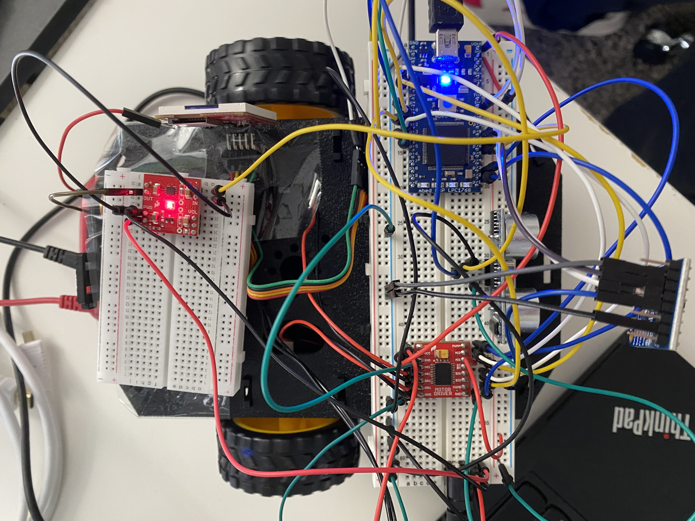

# Obstacle Avoidance and Manual Control Car
### Team Members: Mengxuan Xie, Yijun Lai

## Project Overview
### Autonomous mode
- Detect obstacles using an Ultrasonic sensor.
- Alerts through auditory warning using a Speaker.
- Capability to avoid obstacles.

### Manual control mode
- Bluetooth control to switch between modes and control movement.

## Parts Used
- **LPC1768 microcontroller**: Central processing unit of the car.
- **Adafruit Bluetooth module**: Enables wireless communication for remote control.
- **Ultrasonic sensor**: Used for obstacle detection.
- **Speaker**: Provides auditory alerts.
- **uLCD screen**: Displays distance information.
- **Dual H-bridge motor driver**: Controls the car's movement.

## Block Diagram


## Device Setup



## Demo
[](https://youtube.com/shorts/feu3WhXpSv0)

## Summary
- The Smart Obstacle Avoidance and Manual Control Car has been successfully developed and tested, performing largely as expected. A notable limitation is the ultrasonic sensor's narrow field of view, which can lead to the car's edges occasionally colliding with obstacles. This is primarily due to the sensor's inability to detect objects that are not directly in front of it.
- To address the current limitation, integrating a 360-degree LiDAR sensor is proposed. This would significantly enhance the car's spatial awareness, allowing it to navigate more complex environments, such as efficiently exiting a 2D maze by following the right wall.
- For future iterations, adding a camera system could provide visual feedback to the remote operator. 

## Program
```cpp
#include "mbed.h"
#include "Motor.h"
#include "ultrasonic.h"
#include "uLCD_4DGL.h"
#include "rtos.h"

Motor leftMotor(p23, p6, p5); // PWM, forward, reverse
Motor rightMotor(p22, p12, p11);
Serial bluetooth(p28, p27);
uLCD_4DGL uLCD(p13, p14, p30); // Serial TX, RX, reset pin

PwmOut speaker(p26);
ultrasonic distanceSensor(p9, p10, .1, 1, &updateDistanceDisplay);

Mutex uLCD_mutex;
Mutex speaker_mutex;
bool manualMode = false; // Flag for manual mode

void updateDistanceDisplay(int distance) {
    uLCD_mutex.lock();
    // Code to execute when the distance has changed
    printf("Distance %d mm\r\n", distance);
    uLCD.cls(); // Clear the screen
    uLCD.locate(0, 0); // Set cursor to top left corner
    uLCD.text_width(2); // 2X size text
    uLCD.text_height(2);
    uLCD.printf("Distance: %d mm", distance); // Print the distance
    uLCD_mutex.unlock();
}

void bluetoothThread(void const *args) {
    while (true) {
        processBluetoothInput();
        Thread::wait(10);
    }
}

void controlThread(void const *args) {
    while (true) {
        if (!manualMode) {
            controlMotorsAuto();
        }
        Thread::wait(100);
    }
}

void processBluetoothInput() {
    char buttonNumber, buttonState;
    if (bluetooth.readable()) {
        if (bluetooth.getc() == '!') {
            if (bluetooth.getc() == 'B') { // Button data packet
                buttonNumber = bluetooth.getc(); // Button number
                buttonState = bluetooth.getc(); // 1=pressed, 0=released
                // Mode selection
                if (buttonNumber == '1' && buttonState == '1') {
                    manualMode = true; // Switch to manual mode
                } else if (buttonNumber == '2' && buttonState == '1') {
                    manualMode = false; // Switch to automatic mode
                }
                if (manualMode) {
                    controlMotorsManual(buttonNumber, buttonState);
                }
            }
        }
    }
}

void controlMotorsManual(char buttonNumber, char buttonState) {
    float speed = (buttonState == '1') ? 0.2 : 0;
    switch (buttonNumber) {
        case '5': // Forward
            leftMotor.speed(speed);
            rightMotor.speed(speed);
            break;
        case '6': // Backward
            leftMotor.speed(-speed);
            rightMotor.speed(-speed);
            break;
        case '7': // Left
            leftMotor.speed(-speed);
            rightMotor.speed(speed);
            break;
        case '8': // Right
            leftMotor.speed(speed);
            rightMotor.speed(-speed);
            break;
        default:
            leftMotor.speed(0);
            rightMotor.speed(0);
            break;
    }
}

void controlMotorsAuto() {
    if (distanceSensor.getCurrentDistance() < 100) {
        // Obstacle detected
        leftMotor.speed(0);
        rightMotor.speed(0);
        wait(1);
        // Avoidance maneuver
        leftMotor.speed(-0.2); // Turn left
        rightMotor.speed(-0.2);
        wait(1);
        leftMotor.speed(0.4); // Move forward
        rightMotor.speed(0);
        wait(2);
        leftMotor.speed(0.2); // Move forward
        rightMotor.speed(0.2);
    } else {
        // Move forward
        leftMotor.speed(0.2);
        rightMotor.speed(0.2);
    }
}

int main() {
    distanceSensor.startUpdates(); // Start measuring the distance
    speaker.period(1.0/500.0);

    osThreadDef(bluetoothThread, osPriorityNormal, DEFAULT_STACK_SIZE);
    osThreadId t1 = osThreadCreate(osThread(bluetoothThread), NULL);

    osThreadDef(controlThread, osPriorityNormal, DEFAULT_STACK_SIZE);
    osThreadId t2 = osThreadCreate(osThread(controlThread), NULL);

    while (true) {
        distanceSensor.checkDistance();
        speaker_mutex.lock();
        speaker = (distanceSensor.getCurrentDistance() < 100) ? 0.1 : 0.0;
        speaker_mutex.unlock();
        Thread::wait(100);
    }
}

```
